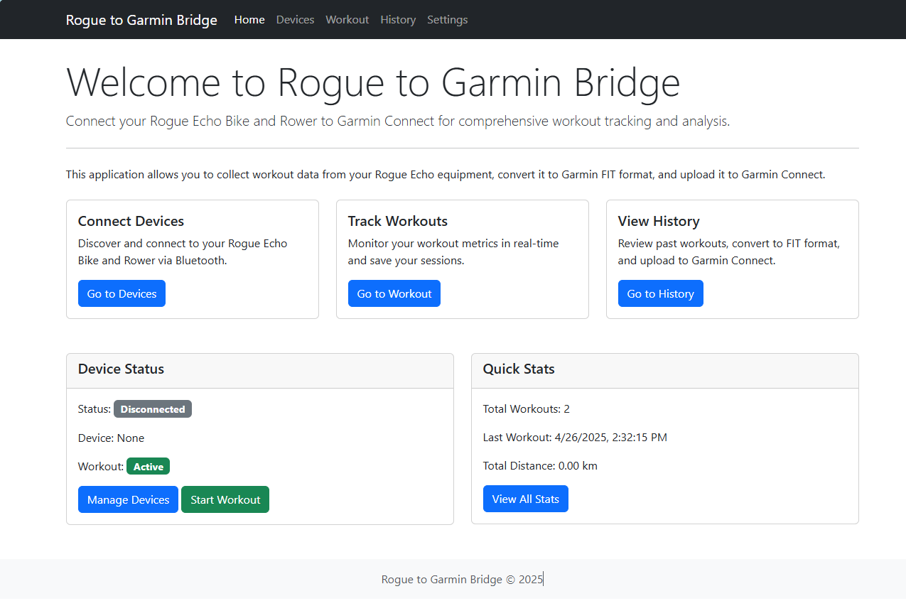

# Rogue Garmin Bridge

A Python application that bridges Rogue fitness equipment (Echo Bike and Rower) to Garmin Connect, allowing seamless tracking and analysis of your workouts.

## Overview

Rogue Garmin Bridge connects to Rogue Echo Bike and Rower equipment via Bluetooth Low Energy (BLE) using the Fitness Machine Service (FTMS) standard. It collects workout metrics, processes the data, and converts it to the Garmin FIT file format for upload to Garmin Connect. The application includes a web-based user interface for configuration, monitoring, and managing workout data.



## Features

- **FTMS Bluetooth Connectivity**: Connect to Rogue Echo Bike and Rower equipment via BLE
- **Real-time Workout Tracking**: Monitor power, heart rate, cadence, speed, distance, and calories in real-time
- **Workout History**: View past workout details with performance metrics and charts
- **FIT File Generation**: Convert workout data to Garmin FIT format with proper device identification
- **Training Load Calculation**: Generated FIT files correctly report training load in Garmin Connect
- **Speed Data Analysis**: Improved speed calculations and display in workout history
- **Garmin Connect Integration**: Upload workouts directly to Garmin Connect
- **Web Interface**: User-friendly interface for monitoring, configuring, and managing workouts
- **FTMS Device Simulator**: Test functionality without physical hardware (development mode)

## System Requirements

- Python 3.9+
- Bluetooth adapter with BLE support
- Operating System: Windows, macOS, or Linux (Raspberry Pi compatible)
- Web browser for accessing the user interface

## Installation

### Prerequisites

- Python 3.9 or higher
- pip (Python package installer)
- Git (optional, for cloning the repository)

### Installation Steps

1. Clone the repository (or download and extract the ZIP file):
   ```
   git clone https://github.com/yourusername/rogue_garmin_bridge.git
   cd rogue_garmin_bridge
   ```

2. Create and activate a virtual environment (optional but recommended):
   ```
   python -m venv .venv
   # On Windows:
   .venv\Scripts\activate
   # On macOS/Linux:
   source .venv/bin/activate
   ```

3. Install the required dependencies:
   ```
   pip install -r requirements.txt
   ```

## Usage

### Starting the Application

1. Navigate to the project directory:
   ```
   cd rogue_garmin_bridge
   ```

2. Start the web application:
   ```
   python src/web/app.py
   ```

3. Open a web browser and navigate to:
   ```
   http://localhost:5000
   ```

### Connecting to Rogue Equipment

1. Navigate to the "Devices" page in the web interface
2. Click "Scan for Devices" to discover available Rogue equipment
3. Select your device from the list and click "Connect"
4. Once connected, the device status will show as "Connected"

### Starting a Workout

1. Navigate to the "Workout" page
2. Click "Start Workout" to begin tracking
3. Your workout metrics will be displayed in real-time
4. Click "End Workout" when finished

### Viewing Workout History

1. Navigate to the "History" page
2. Browse through your past workouts
3. Click on a workout to view detailed metrics and charts
4. View speed data visualizations instead of distance for more useful analysis

### Uploading to Garmin Connect

1. Navigate to the "History" page
2. Select a workout from the list
3. Click the "FIT" button to generate and download the FIT file
4. Manually upload the FIT file to Garmin Connect, or
5. Click "Upload to Garmin" to send the workout directly to Garmin Connect
6. Enter your Garmin Connect credentials if prompted

## Recent Improvements

### May 2025 Updates

- **Proper Training Load Calculation**: FIT files now properly report training load in Garmin Connect by using appropriate device identification
- **Improved Speed Metrics**: Fixed issues with average speed calculation and reporting in FIT files
- **Enhanced Workout Visualization**: Added speed charts in workout history for better performance analysis
- **FIT File Analysis Tools**: Added tools for analyzing and comparing FIT files to ensure compatibility with Garmin Connect

## Project Structure

- `src/ftms/`: Bluetooth connectivity and FTMS protocol implementation
- `src/data/`: Data collection, processing, and storage
- `src/fit/`: FIT file conversion and Garmin Connect upload
- `src/web/`: Web interface (Flask application)
- `docs/`: Project documentation
- `fit_files/`: Generated FIT files from workouts
- `tools/`: Utility scripts for analysis and troubleshooting

## Configuration

Configuration options are available in the web interface under "Settings" or can be set via environment variables:

- `PORT`: The port to run the application on (default: 5000)
- `DEBUG`: Set to "True" to enable debug mode (default: False)
- `DATABASE_URL`: URL for the database (default: SQLite database in the data directory)
- `SECRET_KEY`: Secret key for session encryption (required for production)

## Development

### FTMS Device Simulator

For development without physical hardware, the application includes an FTMS device simulator:

1. Start the application with the simulator flag:
   ```
   python src/web/app.py --use-simulator
   ```

2. The simulator will appear as a device that can be connected to from the web interface

3. For detailed instructions on using the simulator to test workouts, please see the [Testing with the FTMS Simulator](docs/testing_with_simulator.md) documentation.

### FIT File Analysis

The project includes tools for analyzing FIT files:

- `compare_fit_files.py`: Compare device identification and other metadata between FIT files
- `compare_speed_fields.py`: Analyze speed data in FIT files for troubleshooting

### Running Tests

```
pytest
```

## Troubleshooting

### Common Issues

- **Bluetooth Connection Problems**: Ensure your Bluetooth adapter supports BLE and is enabled
- **Device Not Found**: Make sure your Rogue equipment is powered on and in Bluetooth pairing mode
- **Upload to Garmin Fails**: Check your internet connection and Garmin Connect credentials
- **Incorrect Speed Data**: If speed is not showing in Garmin Connect, check your FIT files using the analysis tools

## Contributing

Contributions are welcome! Please feel free to submit a Pull Request.

## License

This project is licensed under the MIT License - see the LICENSE file for details.

## Acknowledgments

- Rogue Fitness for their FTMS-compatible equipment
- The Garmin Connect team for their fitness platform
- All contributors to the Python libraries used in this project